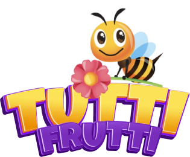
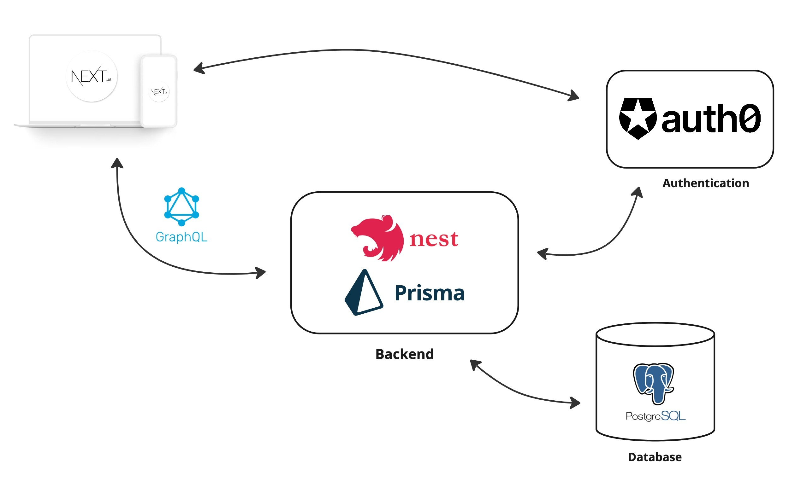

[![Build][build-shield]][build-url]
[![Language][language-shield]][build-url]
[![MIT License][license-shield]][license-url]

 

  

  

    Tutti Frutti: A small game, based on the well-known Tutti Frutti game. Was implemented at a hackathon at Toptal.
  

## Get started

1. Copy the `.env.example` file to `.env`
2. `yarn install`
3. `yarn start`
4. open http://localhost:4200/

## Development Update

`yarn dev:update` - runs yarn install, prisma migrations and data import

## Database

1. Run `docker-compose up` to set up database container locally
2. Run `yarn prisma:migrate-dev` to run migrations

### Prisma scripts

`yarn prisma:migrate-dev` - runs migrations in development mode

`yarn prisma:studio` - opens prisma studio

### Data

`yarn dev:import` - imports categories and words from googlesheet

## Built With

* [Nx](https://nx.dev/)
* [NextJS](https://nextjs.org/)
* [NestJS](https://nestjs.com/)
* [PostgresSQL](https://www.postgresql.org/)
* [Auth0](https://auth0.com/)
 

  

[build-shield]: https://img.shields.io/github/workflow/status/uebelack/tutti-frutti/ci.svg?style=for-the-badge
[build-url]: https://github.com/uebelack/tutti-frutti/actions/workflows/ci.yml
[language-shield]: https://img.shields.io/github/languages/top/uebelack/tutti-frutti.svg?style=for-the-badge
[language-url]: https://github.com/uebelack/tutti-frutti
[coverage-shield]: https://img.shields.io/coveralls/github/uebelack/tutti-frutti.svg?style=for-the-badge
[coverage-url]: https://coveralls.io/github/uebelack/tutti-frutti
[license-shield]: https://img.shields.io/github/license/uebelack/tutti-frutti.svg?style=for-the-badge
[license-url]: https://github.com/uebelack/tutti-frutti/blob/master/LICENSE.txt
